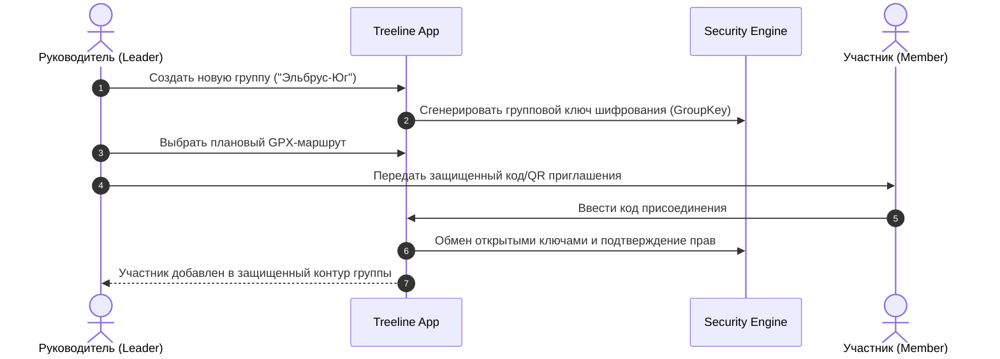
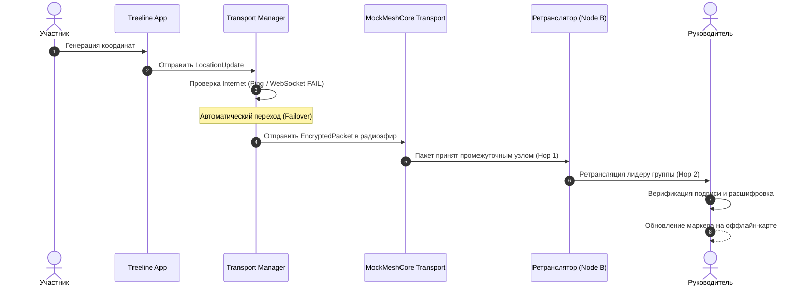

# Сценарии использования (Use Cases)

**Статус документа:** `COMPLETED`  
**Категория:** Продуктовая спецификация (`01-product`)

---

## UC-01: Подготовка к экспедиции и формирование закрытой группы

- **Предусловия:** Руководитель и участники установили приложение и создали локальные криптографические профили.
- **Основной поток:**
  1. Лидер создает группу, задает название и политику приватности.
  2. Генерируется уникальный `groupId` и симметричный сессионный ключ группы.
  3. Участники присоединяются, подтверждая открытые ключи подписи.
  4. Лидер загружает трек маршрута, контрольные точки и безопасный радиус.
- **Результат:** Сформирован доверенный контур группы, все члены имеют необходимые ключи для расшифровки телеметрии друг друга.

---

## UC-02: Защищенный трекинг при штатном интернет-соединении

- **Предусловия:** Экспедиция начата (`Expedition Mode = ACTIVE`), интернет доступен.
- **Основной поток:**
  1. GPS-модуль устройства получает координаты (`lat`, `lng`, `alt`, `accuracy`).
  2. Модуль приватности применяет фильтр в соответствии с режимом (`NORMAL` / `REDUCED_PRIVACY`).
  3. Формируется структура `LocationUpdate` с меткой времени, зарядом батареи и порядковым номером (`sequence`).
  4. Слой безопасности подписывает пакет ключом автора (Ed25519) и шифрует групповым ключом (AES-GCM / ChaCha20-Poly1305).
  5. `TransportManager` определяет доступность интернета и передает `EncryptedPacket` через `InternetTransport`.
  6. Устройства участников принимают пакет, проверяют подпись, расшифровывают и отображают маркер на карте.

---

## UC-03: Автоматический переход в Mesh-сеть при потере сотовой связи (Failover)

- **Предусловия:** Группа зашла в зону без сотовой связи.
- **Основной поток:**
  1. `TransportManager` фиксирует таймаут `InternetTransport`.
  2. Статус транспорта переключается в `MESH_ACTIVE`.
  3. Пакет направляется в `MockMeshCoreTransport`.
  4. Пакет ретранслируется через виртуальные mesh-ноды до устройства лидера.
  5. Лидер видит актуальную позицию участника со специальным индикатором: *«Доставлено по радиоканалу (Mesh, 2 прыжка)»*.

---

## UC-04: Полный блэкаут связи и оффлайн Store-and-Forward

- **Предусловия:** Нет ни интернета, ни узлов mesh-сети в радиусе видимости.
- **Основной поток:**
  1. `TransportManager` определяет невозможность немедленной отправки.
  2. Зашифрованный пакет помещается в локальную оффлайн-очередь (`OfflineStore`).
  3. При возобновлении любого из каналов связи запускается фоновый воркер синхронизации.
  4. Накопленные пакеты пачками передаются получателям с сохранением исходных меток времени.
  5. Получатель дедуплицирует ранее полученные данные по `messageId` и выстраивает правильный исторический трек.

---

## UC-05: Активация экстренного сигнала бедствия (SOS Workflow)

- **Предусловия:** Участник получил травму или попал в критическую ситуацию.
- **Основной поток:**
  1. Пользователь зажимает кнопку **SOS** на 3 секунды для исключения ложного срабатывания.
  2. Формируется высокоприоритетный `EmergencyEvent` с флагом `severity: CRITICAL`, точными координатами и уровнем батареи.
  3. Пакет экстренно шифруется, подписывается и отправляется одновременно по всем доступным транспортам (`Internet` + `MeshBroadcast`).
  4. Все участники группы получают звуковое и визуальное предупреждение с направлением и расстоянием до пострадавшего.
  5. Симулированный шлюз экстренных служб (`MockEmergencyGateway`) регистрирует инцидент.
