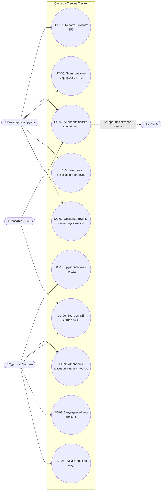
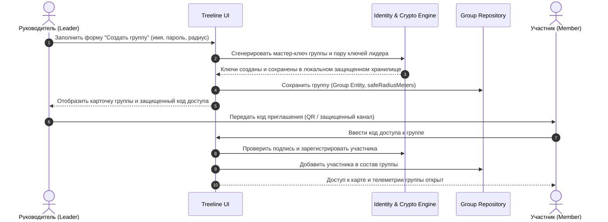
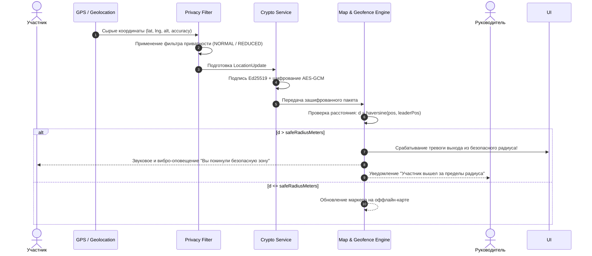
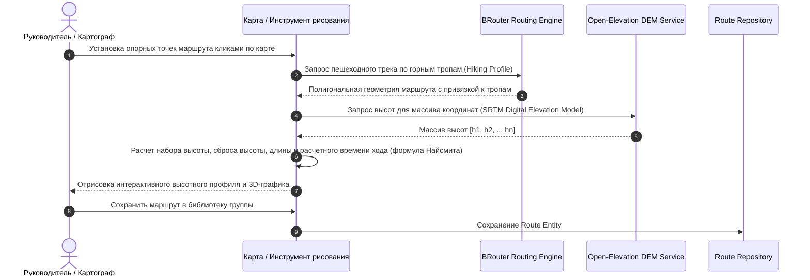
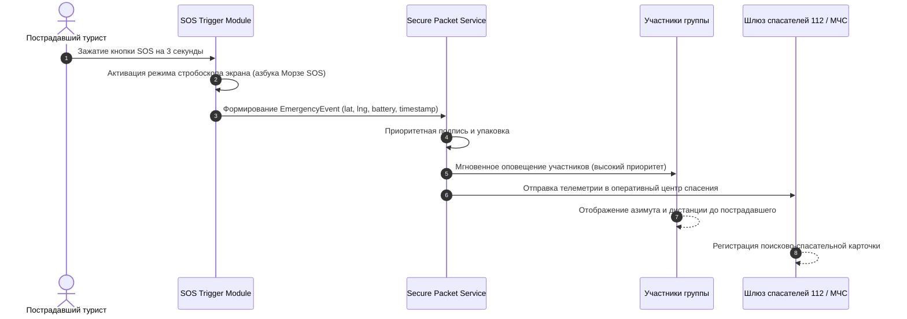
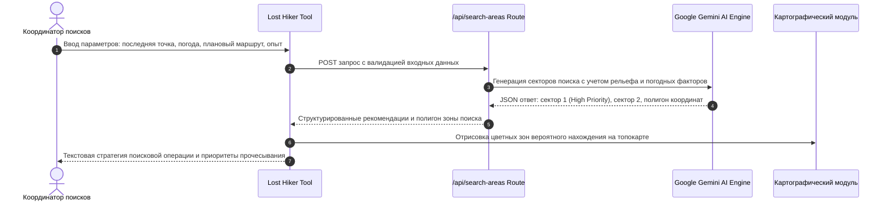

# Сценарии использования (Use Cases)

**Статус документа:** `COMPLETED & UPDATED`  
**Категория:** Продуктовая спецификация (`01-product`)

---

## 🗺️ Общая диаграмма прецедентов (Global Use Case Diagram)

```mermaid
graph LR
    actorUser(["👤 Турист / Участник"])
    actorLeader(["🧭 Руководитель группы"])
    actorSAR(["🚨 Спасатель / МЧС"])
    actorAI(["🤖 Gemini AI"])

    subgraph Treeline ["Система Treeline Tracker"]
        UC01(("UC-01: Создание группы и генерация ключей"))
        UC02(("UC-02: Подключение по коду"))
        UC03(("UC-03: Защищенный гео-трекинг"))
        UC04(("UC-04: Контроль безопасного радиуса"))
        UC05(("UC-05: Планирование маршрута и DEM"))
        UC06(("UC-06: Экстренный сигнал SOS"))
        UC07(("UC-07: AI-анализ поиска пропавшего"))
        UC08(("UC-08: Экспорт и импорт GPX"))
        UC09(("UC-09: Управление ключами и приватностью"))
        UC10(("UC-10: Групповой чат и погода"))
    end

    actorLeader --> UC01
    actorLeader --> UC04
    actorLeader --> UC05
    actorLeader --> UC07
    actorLeader --> UC08

    actorUser --> UC02
    actorUser --> UC03
    actorUser --> UC06
    actorUser --> UC09
    actorUser --> UC10

    actorSAR --> UC06
    actorSAR --> UC07

    UC07 -.->|"Генерация секторов поиска"| actorAI
```

---

## UC-01: Формирование закрытой группы и управление ключами

```mermaid
sequenceDiagram
    autonumber
    actor L as Руководитель (Leader)
    participant UI as Treeline UI
    participant Sec as Identity & Crypto Engine
    participant Repo as Group Repository
    actor M as Участник (Member)

    L->>UI: Заполнить форму "Создать группу" (имя, пароль, радиус)
    UI->>Sec: Сгенерировать мастер-ключ группы и пару ключей лидера
    Sec-->>UI: Ключи созданы и сохранены в локальном защищенном хранилище
    UI->>Repo: Сохранить группу (Group Entity, safeRadiusMeters)
    UI-->>L: Отобразить карточку группы и защищенный код доступа
    L->>M: Передать код приглашения (QR / защищенный канал)
    M->>UI: Ввести код доступа к группе
    UI->>Sec: Проверить подпись и зарегистрировать участника
    UI->>Repo: Добавить участника в состав группы
    UI-->>M: Доступ к карте и телеметрии группы открыт
```

- **Предусловия:** Руководитель авторизован в системе, сгенерирован локальный криптографический профиль.
- **Основной поток:**
  1. Руководитель открывает форму создания группы, указывает наименование, безопасный радиус геозоны (в метрах) и пароль доступа.
  2. Криптографический модуль генерирует симметричный групповой ключ и привязывает идентификатор лидера.
  3. Группа сохраняется в репозитории со статусом `active`.
  4. Лидер делится кодом доступа с участниками похода.
- **Результат:** Замкнутый доверенный контур группы сформирован.

---

## UC-02: Защищенный гео-трекинг и контроль безопасного радиуса (Geofencing)

```mermaid
sequenceDiagram
    autonumber
    actor M as Участник
    participant Sensor as GPS / Geolocation
    participant Filter as Privacy Filter
    participant Sec as Crypto Service
    participant Map as Map & Geofence Engine
    actor L as Руководитель

    Sensor->>Filter: Сырые координаты (lat, lng, alt, accuracy)
    Filter->>Filter: Применение фильтра приватности (NORMAL / REDUCED)
    Filter->>Sec: Подготовка LocationUpdate
    Sec->>Sec: Подпись Ed25519 + шифрование AES-GCM
    Sec->>Map: Передача зашифрованного пакета
    Map->>Map: Проверка расстояния: d = haversine(pos, leaderPos)
    alt d > safeRadiusMeters
        Map->>UI: Срабатывание тревоги выхода из безопасного радиуса!
        Map-->>M: Звуковое и вибро-оповещение "Вы покинули безопасную зону"
        Map-->>L: Уведомление "Участник вышел за пределы радиуса"
    else d <= safeRadiusMeters
        Map-->>Map: Обновление маркера на оффлайн-карте
    end
```

---

## UC-03: Планирование пешеходного маршрута с расчетом рельефа (DEM Elevation)

```mermaid
sequenceDiagram
    autonumber
    actor L as Руководитель / Картограф
    participant MapUI as Карта / Инструмент рисования
    participant BRouter as BRouter Routing Engine
    participant Elev as Open-Elevation DEM Service
    participant Repo as Route Repository

    L->>MapUI: Установка опорных точек маршрута кликами по карте
    MapUI->>BRouter: Запрос пешеходного трека по горным тропам (Hiking Profile)
    BRouter-->>MapUI: Полигональная геометрия маршрута с привязкой к тропам
    MapUI->>Elev: Запрос высот для массива координат (SRTM Digital Elevation Model)
    Elev-->>MapUI: Массив высот [h1, h2, ... hn]
    MapUI->>MapUI: Расчет набора высоты, сброса высоты, длины и расчетного времени хода (формула Найсмита)
    MapUI-->>L: Отрисовка интерактивного высотного профиля и 3D-графика
    L->>MapUI: Сохранить маршрут в библиотеку группы
    MapUI->>Repo: Сохранение Route Entity
```

---

## UC-04: Экстренная активация сигнала бедствия (SOS Workflow)

```mermaid
sequenceDiagram
    autonumber
    actor H as Пострадавший турист
    participant SOS as SOS Trigger Module
    participant Sec as Secure Packet Service
    participant Group as Участники группы
    participant SAR as Шлюз спасателей 112 / МЧС

    H->>SOS: Зажатие кнопки SOS на 3 секунды
    SOS->>SOS: Активация режима стробоскопа экрана (азбука Морзе SOS)
    SOS->>Sec: Формирование EmergencyEvent (lat, lng, battery, timestamp)
    Sec->>Sec: Приоритетная подпись и упаковка
    Sec->>Group: Мгновенное оповещение участников (высокий приоритет)
    Sec->>SAR: Отправка телеметрии в оперативный центр спасения
    Group-->>Group: Отображение азимута и дистанции до пострадавшего
    SAR-->>SAR: Регистрация поисково-спасательной карточки
```

---

## UC-05: Интеллектуальный анализ вероятных зон поиска пропавшего туриста (AI SAR)

```mermaid
sequenceDiagram
    autonumber
    actor SAR as Координатор поисков
    participant UI as Lost Hiker Tool
    participant API as /api/search-areas Route
    participant Gemini as Google Gemini AI Engine
    participant Map as Картографический модуль

    SAR->>UI: Ввод параметров: последняя точка, погода, плановый маршрут, опыт
    UI->>API: POST запрос с валидацией входных данных
    API->>Gemini: Генерация секторов поиска с учетом рельефа и погодных факторов
    Gemini-->>API: JSON ответ: сектор 1 (High Priority), сектор 2, полигон координат
    API-->>UI: Структурированные рекомендации и полигон зоны поиска
    UI->>Map: Отрисовка цветных зон вероятного нахождения на топокарте
    UI-->>SAR: Текстовая стратегия поисковой операции и приоритеты прочесывания
```

---

## UC-06: Экспорт и архивация треков в стандартном формате GPX

- **Предусловия:** В системе сохранен хотя бы один завершенный или спланированный маршрут.
- **Основной поток:**
  1. Пользователь переходит в профиль или планировщик маршрутов.
  2. Выбирает маршрут или опцию *«Экспортировать все треки в GPX»*.
  3. `GpxExporter` формирует валидный XML-документ стандарта GPX 1.1 с трекпоинтами `<trkpt>`, высотами `<ele>` и временными метками `<time>`.
  4. Инициируется скачивание файла `.gpx` на локальное устройство для использования в Garmin, Locus Map или OsmAnd.
