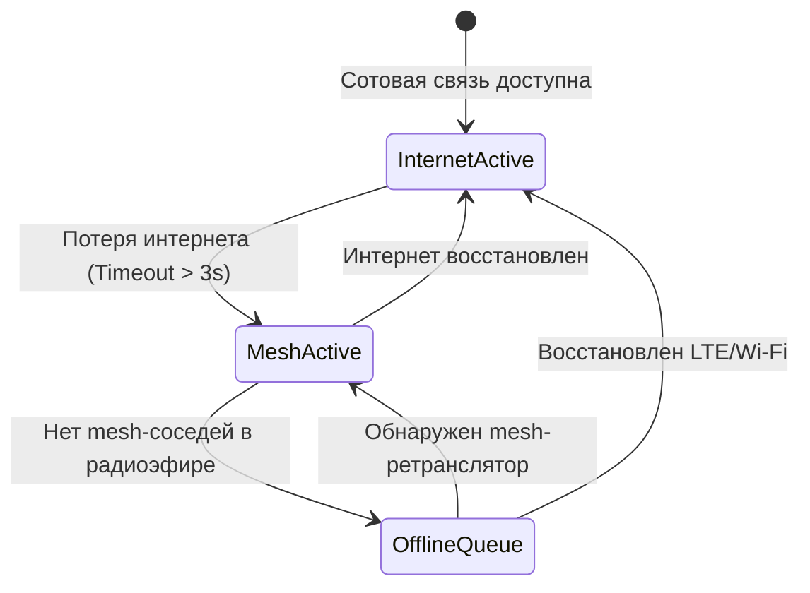

# Коммуникационный слой и гибридный транспорт (Communication & Transport Architecture)

**Статус документа:** `COMPLETED`  
**Категория:** Архитектурная спецификация (`03-architecture`)

---

## 1. Концепция Transport Abstraction

Коммуникационный слой изолирует приложение от конкретных физических каналов связи. Логика отправки координат не зависит от того, передаются ли данные через мобильный интернет, симулированный радиоканал LoRa (MeshCore) или помещаются в оффлайн-буфер.

```typescript
// src/core/transport/transport.interface.ts
export interface ITransport {
  id: 'internet' | 'meshcore' | 'mock';
  name: string;
  isAvailable(): Promise<boolean>;
  sendLocation(packet: EncryptedPacket): Promise<DeliveryResult>;
  sendEmergency(packet: EncryptedPacket): Promise<DeliveryResult>;
  sendMessage(packet: EncryptedPacket): Promise<DeliveryResult>;
  getStatus(): TransportStatus;
}
```

---

## 2. Модель автоматического переключения (Failover Controller)



### Логика работы контроллера отказоустойчивости:
1. **Основной транспорт (Internet):** Отправка через HTTPS/WSS. Быстрая доставка, минимальная задержка (< 300 мс).
2. **Резервный транспорт (MeshCore Simulation):** Автоматическая активация при падении интернета. Пакет разбивается/транслируется в виртуальную mesh-сеть.
3. **Оффлайн-буфер (Local Queue):** Если ни один канал не доступен, пакет сохраняется локально с флагом ожидания синхронизации.

---

## 3. Симуляция виртуальной Mesh-сети (`MockMeshCoreTransport`)

Для воспроизведения полевых условий без реального радиооборудования реализован детерминированный симулятор:
- **Узлы (Nodes):** Набор виртуальных участников (Node A, Node B, Node C, Node D) с координатами и зонами радиопокрытия.
- **Многошаговая ретрансляция (Multi-hop Routing):** Если Узел A не видит Узел D напрямую, пакет передается через Узел B или C.
- **Параметры симуляции:** Возможность динамически задавать задержку (Latency: 200–2500 мс), процент потерь пакетов (Packet Loss: 0–40%) и коллизии эфира.
