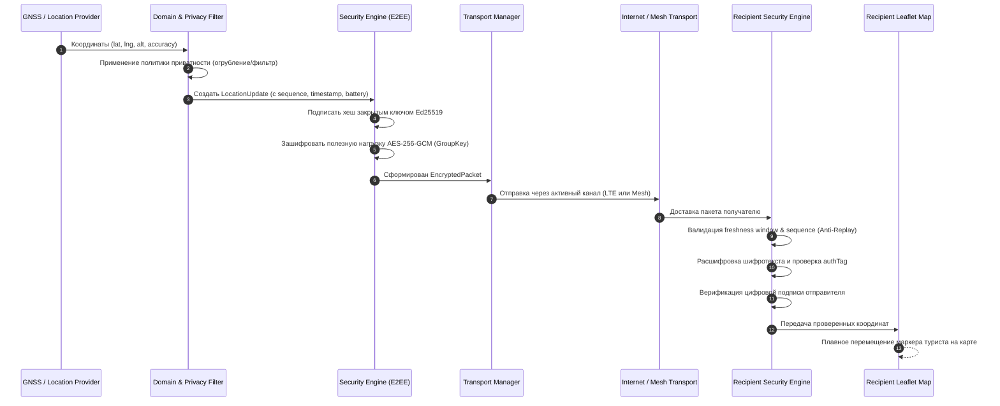

# Потоки данных (Data Flow Architecture)

**Статус документа:** `COMPLETED`  
**Категория:** Архитектурная спецификация (`03-architecture`)

---

## 1. Сквозной поток пакета локации (End-to-End Vertical Slice)

Ниже представлена детальная схема прохождения данных от момента считывания аппаратных координат до их отрисовки на карте получателя:



---

## 2. Формат данных на различных уровнях

### Уровень домена (Plaintext Domain Model):
```json
{
  "version": 1,
  "messageId": "msg_89f1a23c",
  "senderId": "usr_daniil_01",
  "groupId": "grp_caucasus_2026",
  "timestamp": 1789745120000,
  "sequence": 42,
  "latitude": 43.3499,
  "longitude": 42.4453,
  "altitude": 2840.5,
  "accuracy": 4.2,
  "battery": 86,
  "status": "MOVING"
}
```

### Проводной / Сетевой уровень (Wire-Level Encrypted Packet):
```json
{
  "version": 1,
  "senderId": "usr_daniil_01",
  "recipientGroupId": "grp_caucasus_2026",
  "nonce": "a7b8c9d0e1f2a3b4c5d6e7f8",
  "ciphertext": "8f3b2e1a9c4d5e6f708192a3b4c5d6e7f8...",
  "authenticationTag": "e4f5a6b7c8d9e0f1",
  "signature": "3045022100a9b8c7d6e5f4...",
  "transportMetadata": {
    "hopCount": 2,
    "rssi": -85,
    "snr": 7.5
  }
}
```

> **Важно:** Никакие промежуточные узлы, серверные базы данных или перехватчики радиоэфира не могут восстановить географические координаты из поля `ciphertext` без владения закрытым симметричным ключом группы (`GroupKey`).
