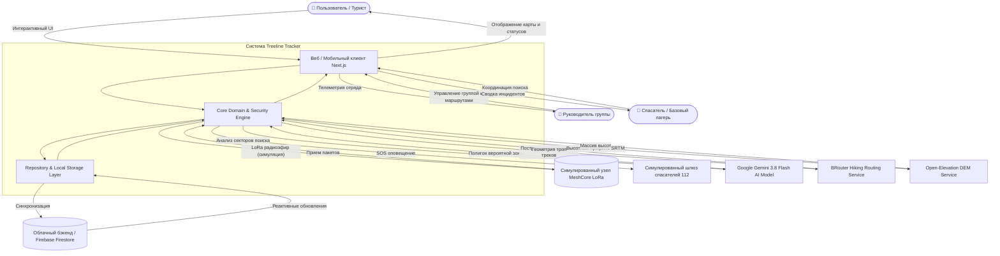
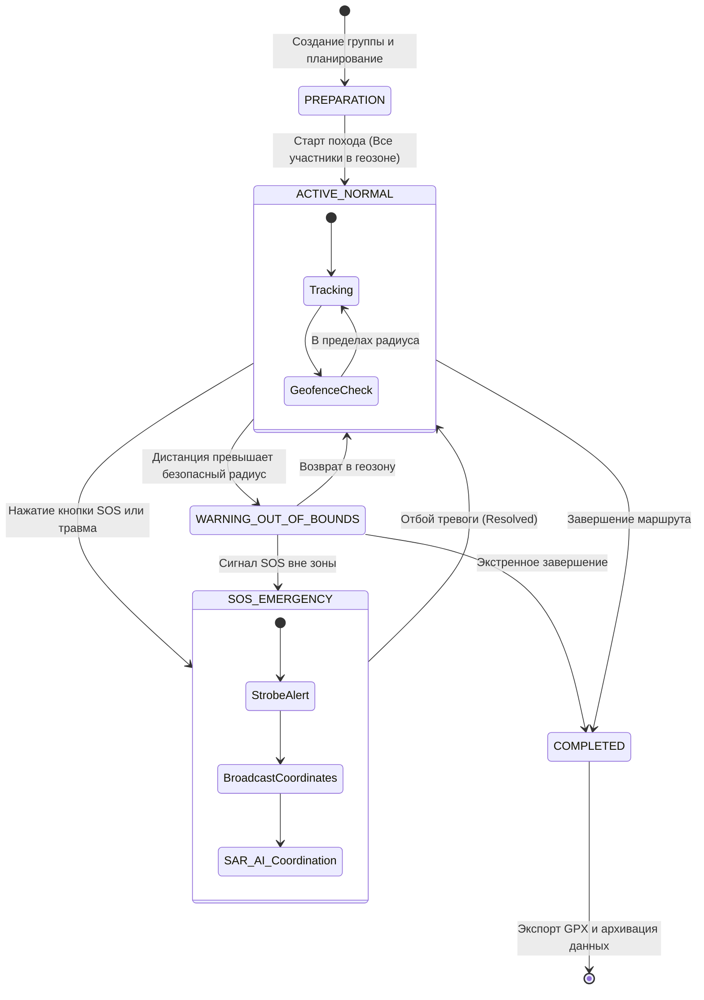

# Системная архитектура Treeline Tracker (System Architecture)

**Статус документа:** `COMPLETED & UPDATED`  
**Категория:** Архитектурная спецификация (`03-architecture`)

---

## 1. Архитектурная модель C4: Контекст системы (System Context)



---

## 2. Полная диаграмма классов (UML Class Diagram)

Ниже представлена детальная диаграмма классов предметной области, интерфейсов репозиториев, слоя безопасности и вспомогательных сервисов:

```mermaid
classDiagram
    %% Domain Entities
    class GeoCoordinate {
        +number latitude
        +number longitude
        +number altitude
        +number accuracy
        +number speed
        +number heading
    }

    class HikerLocation {
        +string id
        +string hikerId
        +string hikerName
        +GeoCoordinate coordinates
        +number batteryLevel
        +Date timestamp
        +boolean isLeader
        +boolean isSosActive
        +number sequenceNumber
    }

    class Group {
        +string id
        +string name
        +string leaderId
        +string passcode
        +number safeRadiusMeters
        +Date createdAt
        +string status
        +GroupMember[] members
        +Route activeRoute
    }

    class GroupMember {
        +string id
        +string name
        +string role
        +string publicKey
        +Date joinedAt
        +HikerLocation lastLocation
    }

    class Route {
        +string id
        +string name
        +string description
        +GeoCoordinate[] coordinates
        +number totalDistanceKm
        +number elevationGainMeters
        +number elevationLossMeters
        +number estimatedTimeMinutes
        +Waypoint[] waypoints
        +Date createdAt
    }

    class Waypoint {
        +string id
        +string name
        +string type
        +GeoCoordinate coordinates
        +string notes
    }

    class EmergencyEvent {
        +string id
        +string hikerId
        +string hikerName
        +string groupId
        +GeoCoordinate location
        +number batteryLevel
        +string message
        +string severity
        +Date timestamp
        +boolean isResolved
    }

    class UserIdentity {
        +string userId
        +string displayName
        +string publicKey
        +string privateKey
        +Date createdAt
        +Date keyRotatedAt
    }

    %% Repository Interfaces
    class ILocationRepository {
        <<interface>>
        +saveLocation(HikerLocation location) Promise~void~
        +getLatestLocation(string hikerId) Promise~HikerLocation~
        +getLocationHistory(string hikerId, number limit) Promise~HikerLocation[]~
        +clearLocationHistory(string hikerId) Promise~void~
    }

    class IGroupRepository {
        <<interface>>
        +getGroups() Promise~Group[]~
        +getGroupById(string id) Promise~Group~
        +createGroup(Group group) Promise~Group~
        +updateGroup(Group group) Promise~void~
        +deleteGroup(string id) Promise~void~
    }

    class IRouteRepository {
        <<interface>>
        +getRoutes() Promise~Route[]~
        +getRouteById(string id) Promise~Route~
        +saveRoute(Route route) Promise~Route~
        +deleteRoute(string id) Promise~void~
    }

    class IEmergencyRepository {
        <<interface>>
        +triggerSos(EmergencyEvent event) Promise~void~
        +getActiveAlerts(string groupId) Promise~EmergencyEvent[]~
        +resolveAlert(string eventId) Promise~void~
    }

    %% Concrete Repositories
    class LocalStorageLocationRepository {
        -string storageKey
        +saveLocation(HikerLocation location) Promise~void~
        +getLatestLocation(string hikerId) Promise~HikerLocation~
        +getLocationHistory(string hikerId, number limit) Promise~HikerLocation[]~
        +clearLocationHistory(string hikerId) Promise~void~
    }

    class LocalStorageGroupRepository {
        -string storageKey
        +getGroups() Promise~Group[]~
        +getGroupById(string id) Promise~Group~
        +createGroup(Group group) Promise~Group~
        +updateGroup(Group group) Promise~void~
        +deleteGroup(string id) Promise~void~
    }

    class LocalStorageRouteRepository {
        -string storageKey
        +getRoutes() Promise~Route[]~
        +getRouteById(string id) Promise~Route~
        +saveRoute(Route route) Promise~Route~
        +deleteRoute(string id) Promise~void~
    }

    class LocalStorageEmergencyRepository {
        -string storageKey
        +triggerSos(EmergencyEvent event) Promise~void~
        +getActiveAlerts(string groupId) Promise~EmergencyEvent[]~
        +resolveAlert(string eventId) Promise~void~
    }

    %% Security & Cryptography Services
    class CryptoService {
        +generateKeyPair() Promise~KeyPair~
        +encryptPayload(string payload, string secretKey) Promise~EncryptedData~
        +decryptPayload(EncryptedData encrypted, string secretKey) Promise~string~
        +signData(string data, string privateKey) Promise~string~
        +verifySignature(string data, string signature, string publicKey) Promise~boolean~
    }

    class IdentityManager {
        +getOrCreateLocalIdentity() UserIdentity
        +rotateLocalIdentity() UserIdentity
        +exportPublicProfile() PublicProfile
    }

    class PrivacyFilter {
        +applyPrivacyMode(GeoCoordinate raw, PrivacyMode mode) GeoCoordinate
        +truncateCoordinates(GeoCoordinate raw, number decimals) GeoCoordinate
        +addNoise(GeoCoordinate raw, number radiusMeters) GeoCoordinate
    }

    class ReplayProtection {
        -Map~string, number~ sequenceCounters
        +validateSequence(string senderId, number sequence) boolean
        +recordSequence(string senderId, number sequence) void
    }

    %% Navigation & Routing Services
    class BRouterService {
        -string baseUrl
        +calculateHikingRoute(GeoCoordinate start, GeoCoordinate end) Promise~GeoCoordinate[]~
    }

    class ElevationService {
        -string elevationApiUrl
        +fetchElevations(GeoCoordinate[] points) Promise~number[]~
        +computeElevationStats(number[] elevations, number totalDistance) ElevationStats
    }

    class GpxExporter {
        +exportRoutesAsGpx(Route[] routes) string
        +parseGpx(string gpxXml) Route
    }

    %% Relationships
    Group "1" *-- "many" GroupMember : contains
    Group "1" o-- "0..1" Route : activeRoute
    GroupMember "1" o-- "1" HikerLocation : lastLocation
    Route "1" *-- "many" Waypoint : contains
    HikerLocation "1" *-- "1" GeoCoordinate : at

    ILocationRepository <|.. LocalStorageLocationRepository : implements
    IGroupRepository <|.. LocalStorageGroupRepository : implements
    IRouteRepository <|.. LocalStorageRouteRepository : implements
    IEmergencyRepository <|.. LocalStorageEmergencyRepository : implements

    LocalStorageGroupRepository ..> Group : manages
    LocalStorageRouteRepository ..> Route : manages
    LocalStorageLocationRepository ..> HikerLocation : manages
    LocalStorageEmergencyRepository ..> EmergencyEvent : manages
    IdentityManager ..> UserIdentity : manages
    IdentityManager ..> CryptoService : uses
```



---

## 3. Архитектура слоев (Layered Separation)

```
┌────────────────────────────────────────────────────────────────────────┐
│                        1. Presentation Layer (UI)                      │
│   - React 18 Components & Views (Map, Chat, Routes, Lost Hiker, SOS)  │
│   - ViewModels, UI State, Theme & Responsive Layout                    │
└───────────────────────────────────┬────────────────────────────────────┘
                                    │ Calls
┌───────────────────────────────────▼────────────────────────────────────┐
│                    2. Application & Coordination Layer                 │
│   - Expedition Manager, Safety Controller, Simulation Orchestrator     │
│   - Observability & Logging Service                                    │
└───────────────────────────────────┬────────────────────────────────────┘
                                    │ Uses
┌───────────────────────────────────▼────────────────────────────────────┐
│                         3. Pure Domain Layer                           │
│   - Entities: LocationUpdate, Group, Member, Route, EmergencyEvent     │
│   - Value Objects: GeoCoordinate, BatteryLevel, SequenceNumber         │
│   - Business Rules: Geofence checking, Pace analysis, Retention policy │
└───────────────────────────────────┬────────────────────────────────────┘
                                    │ Encrypts / Signs
┌───────────────────────────────────▼────────────────────────────────────┐
│                          4. Security Layer                             │
│   - Key Pair Generation & Identity (Ed25519)                           │
│   - Authenticated Encryption (AES-GCM / ChaCha20-Poly1305)             │
│   - Replay Protection & Sequence Validation                            │
└───────────────────────────────────┬────────────────────────────────────┘
                                    │ Persists / Buffers
┌───────────────────────────────────▼────────────────────────────────────┐
│                       5. Infrastructure & Storage                      │
│   - Repositories: IGroupRepository, IRouteRepository, IOfflineQueue    │
│   - Drivers: LocalStorage, IndexedDB, Firebase Firestore (Adapter)     │
└────────────────────────────────────────────────────────────────────────┘
```

---

## 4. Диаграмма состояний экспедиции (Expedition State Machine)


