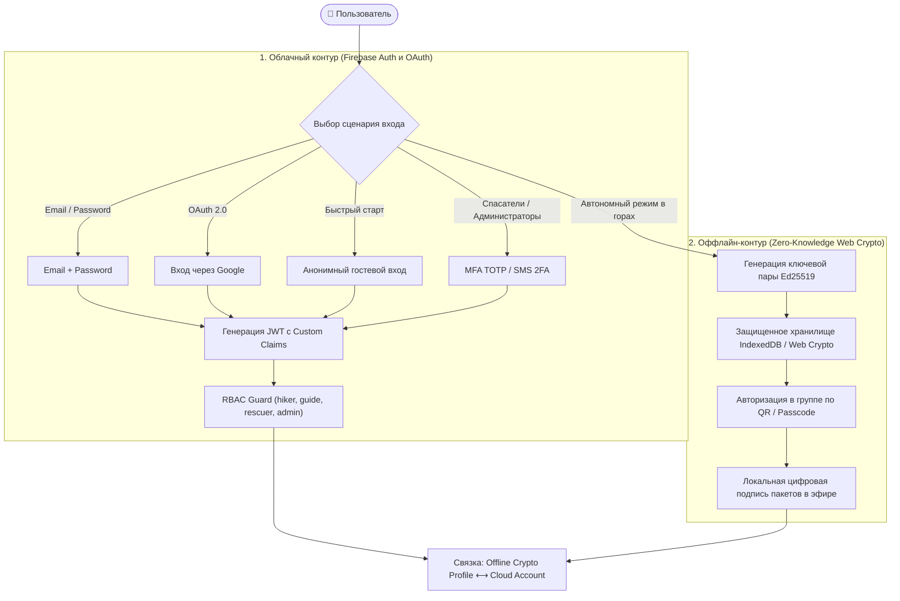

# Идентификация пользователей, аутентификация и RBAC (Identity, Authentication & Access Architecture)

**Статус документа:** `COMPLETED & UPDATED`  
**Категория:** Безопасность и Приватность (`04-security`)

---

## 1. Концепция гибридной двухконтурной аутентификации

В Treeline Tracker реализована передовая **двухконтурная архитектура идентификации и аутентификации** (Hybrid Dual-Layer Auth), спроектированная специально для работы как в условиях стабильного интернета в городе, так и при полном блэкауте сотовой связи в высокогорье и глухом лесу.



---

## 2. Модель учетной записи и профиля пользователя

```typescript
export type UserRole = 'hiker' | 'guide' | 'rescuer' | 'admin';

export type AuthProviderType = 'password' | 'google.com' | 'anonymous' | 'crypto_offline';

export interface UserAccount {
  uid: string;                         // Уникальный идентификатор аккаунта
  email: string | null;                // Email адрес (null для анонимных пользователей)
  emailVerified: boolean;              // Флаг верификации почты
  displayName: string;                 // Отображаемое имя ("Дмитрий", "Даниил")
  photoURL: string | null;             // Ссылка на аватар
  phoneNumber?: string;                // Телефон для экстренной связи / 2FA
  providerId: AuthProviderType;        // Основной провайдер аутентификации
  role: UserRole;                      // Роль в системе (RBAC)
  customClaims: {
    role: UserRole;
    activeGroupId?: string | null;
    rescuerSector?: string;            // Географический сектор спасателя (напр., 'caucasus-elbrus')
    guideLicenseId?: string;           // Номер лицензии горного гида / инструктора
    isMfaEnabled?: boolean;            // Обязательный флаг 2FA для ролей rescuer/admin
  };
  mfaEnrolled: boolean;                // Подключена ли двухфакторная аутентификация
  isAnonymous: boolean;                // Признак временного гостевого аккаунта
  createdAt: number;
  lastLoginAt: number;
}

export interface HikerProfileData {
  experienceLevel: 'Beginner' | 'Intermediate' | 'Advanced' | 'Expert';
  emergencyContact: {
    name: string;
    phone: string;
    relationship: string;
  };
  bloodType?: string;                  // Группа крови для экстренных служб (опционально)
  allergiesOrConditions?: string;      // Медицинские противопоказания
  bio?: string;
}
```

---

## 3. Матрица разграничения доступа (Role-Based Access Control Matrix)

Система реализует четыре иерархических уровня привилегий с валидацией как на клиенте (UI Guard), так и на уровне базы данных (`firestore.rules`):

| Роль в системе | Основное назначение | Требования к аутентификации | Разрешенные операции | Запрещенные операции |
|---|---|---|---|---|
| **`hiker`** (Турист) | Участник похода | Email/Password, Google OAuth или Анонимный вход | Запись своей GPS-телеметрии, чтение маршрута и участников своей группы, отправка SOS и чат | Доступ к чужим группам, изменение чужих треков, просмотр закрытых координат спасателей |
| **`guide`** (Гид / Руководитель) | Руководитель группы | Верифицированный Email + проверка квалификации | Создание и управление группами, редактирование маршрутов (OCC), мониторинг геозон (Geofencing) | Доступ к служебным каналам МЧС вне своей экспедиции, изменение системных ролей |
| **`rescuer`** (Спасатель МЧС) | Оператор спасательного центра | Корпоративный аккаунт + Обязательная MFA (TOTP/SMS) | Просмотр всех активных групп в секторе, прием SOS, запуск Gemini AI генерации зон поиска | Изменение маршрутов туристических групп без запроса бедствия |
| **`admin`** (Администратор) | Системный контроль платформы | Аппаратный ключ / MFA + белый список IP | Управление ролями, аудит логов безопасности, мониторинг метрик, управление квотами API | Несанкционированная подмена пользовательских подписей Ed25519 |

---

## 4. Сценарии аутентификации (Auth Workflows)

### 4.1. Вход и регистрация по Email и Паролю
1. Пользователь вводит Email и надежный пароль (минимум 8 символов, заглавная буква, цифра, спецсимвол).
2. Firebase Authentication валидирует пароль и создает учетную запись.
3. Отправляется ссылка для подтверждения адреса электронной почты (`sendEmailVerification`).
4. В коллекции `users/{uid}` создается профиль с ролью по умолчанию `hiker`.

### 4.2. Федеративный вход через Google OAuth 2.0
1. Пользователь выбирает «Войти через Google».
2. Клиент открывает безопасное диалоговое окно авторизации.
3. При успешной авторизации токен передается в приложение, имя и аватар автоматически синхронизируются с профилем.

### 4.3. Анонимный гостевой вход (Guest / Instant Join) и повышение аккаунта (Account Linking)
1. В полевых условиях пользователь может начать работу мгновенно без ввода почты (кнопка *«Войти как гость»*).
2. Создается анонимный `uid`, позволяющий полноценно сохранять треки и вступать в группу.
3. Позже, вернувшись в зону интернета, пользователь в один клик связывает гостевой аккаунт с постоянным Google или Email профилем (`linkWithCredential`) без потери накопленных маршрутов и истории походов.

### 4.4. Двухфакторная аутентификация (MFA / 2FA) для спасателей
1. Операторы служб спасения и администраторы при входе вводят одноразовый TOTP-код (Google Authenticator) или SMS-код.
2. Токен получает расширенные привилегии с клеймом `mfaVerified: true`.

---

## 5. Оффлайн-идентичность и локальный криптографический контур (Ed25519)

Когда группа находится вне зоны действия сотовой сети, сетевые токены JWT не могут быть проверены на удаленном сервере. В этот момент вступает в силу локальный криптографический контур:

1. **Генерация ключей:** При первом старте модуль `identity-manager.ts` создает асимметричную пару ключей Ed25519 через W3C Web Crypto API.
2. **Отпечаток открытого ключа (Fingerprint):** Вычисляется читаемый SHA-256 хеш (вид `A1B2:C3D4:E5F6`), отображаемый в профиле пользователя.
3. **Обмен ключами перед стартом:** Члены группы считывают QR-код друг друга перед выходом на тропу, сохраняя открытые ключи соратников в локальное доверенное хранилище.
4. **Оффлайн-верификация подписи:** Каждый пакет телеметрии, передаваемый по Bluetooth/LoRa/Mesh-радиоканалу, содержит цифровую подпись автора `Ed25519(payload, privateKey)`. Устройства товарищей мгновенно верифицируют подпись даже при полном отсутствии интернета.

---

## 6. Безопасность сессий, Refresh-токены и защита от перехвата

- **Срок жизни Access Token:** JWT-токен валиден в течение 60 минут.
- **Автоматический Refresh:** Фоновое обновление токенов через Firebase SDK.
- **Хранение секретов:** Приватные ключи Ed25519 никогда не отправляются на сервер и не выгружаются в открытом виде, сохраняясь только в изолированном хранилище браузера (IndexedDB с шифрованием).
- **Сброс сессии:** При выходе из аккаунта (Sign Out) происходит инвалидация сессии на сервере и локальная очистка чувствительных кэшей.
