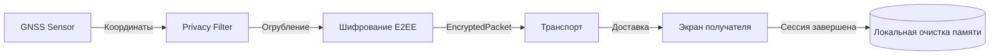

# Политика приватности геоданных (Privacy Architecture)

**Статус документа:** `COMPLETED`  
**Категория:** Безопасность и Приватность (`04-security`)

---

## 1. Принципы минимизации и защиты данных

1. **Минимизация данных (Data Minimization):** В сеть передаются только необходимые параметры: широта, долгота, высота, точность, заряд батареи и метка времени. Никаких персональных метаданных, номеров телефонов или IP-адресов в полезной нагрузке.
2. **Ограничение видимости (Purpose Limitation):** Только участники с подтвержденным членством в группе (`groupId`) и знанием группового ключа могут расшифровать местоположение.
3. **Отсутствие фоновой слежки:** Передача геоданных активна только в режиме экспедиции (`Expedition Mode = ACTIVE`).

---

## 2. Режимы приватности (Privacy Modes)

Пользователь может явно выбрать желаемый уровень детализации в настройках профиля:

```
┌─────────────────┬────────────────────────────────────────────────────────┐
│ Режим           │ Описание поведения и передаваемая точность             │
├─────────────────┼────────────────────────────────────────────────────────┤
│ NORMAL          │ Передача координат с максимальной точностью GNSS (~5м)  │
│ REDUCED_PRIVACY │ Искусственное огрубление сетки до квадрата 200x200м    │
│ EMERGENCY       │ Автоматическое включение макс. точности при сигнале SOS│
│ STEALTH         │ Локальная запись трека без вещания в радиоэфир         │
└─────────────────┴────────────────────────────────────────────────────────┘
```

---

## 3. Жизненный цикл геоданных (Data Lifecycle)



- **Генерация:** Считывание аппаратных координат.
- **Фильтрация:** Применение выбранного режима приватности.
- **Шифрование:** Преобразование в непрозрачный байтовый массив `ciphertext`.
- **Очистка:** При выходе из группы или завершении похода сессионные ключи и временный кэш стираются из памяти.
